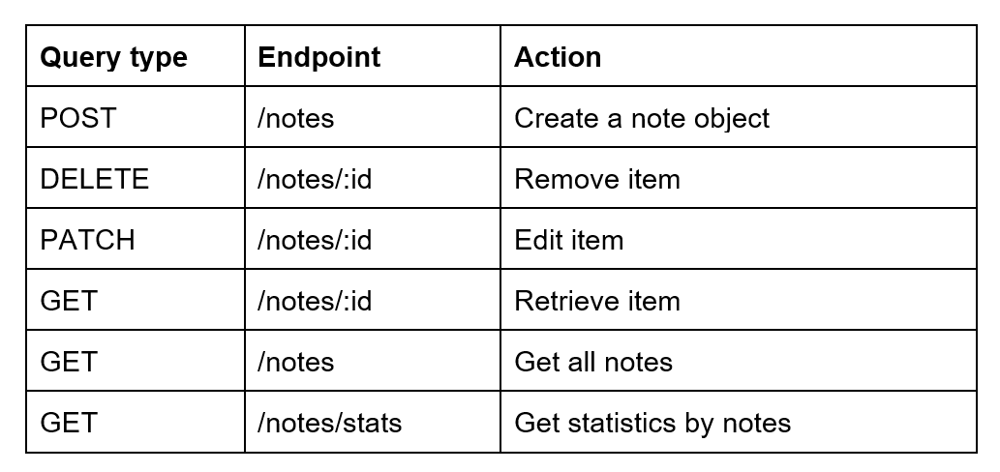

# User Notes Manager backend part

---

## Description

This is a Backend part of the User Notes Manager project which provides on managing notes. The backend is developed using Node.js, Express, TypeScript.

---

## Table of Contents

- [Installation](#installation)
- [Usege](#usege)
- [Endpoints](#endpoints)
- [Technologies Used](#technologies)

---

## Installation <a id="installation"></a>

```
$ git clone https://github.com/Siryi-Oleksandr/radency-test-node.git
$ cd your-project
$ npm install
$ npm run start:dev


```

---

## Usage <a id="usege"></a>

The backend server is now running on http://localhost:3000. You can use it to interact with the notes.

---

## Endpoints <a id="endpoints"></a>



---

## Technologies Used <a id="technologies"></a>

- Node.js
- Express
- TypeScript
- Joi
- JSON (local file for storing notes)
